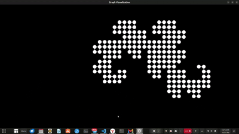

<!-- ==================== СТИЛИ (CSS) ==================== -->

  <!-- 1. ШАПКА -->
  

    
    <h1>Тимур Файз</h1>
    
Data Engineer | Researcher

    

      Инженер-исследователь с фокусом на архитектуре данных и алгоритмах. 
      Мой путь — это сочетание фундаментальной школы МФТИ и прикладного Data Engineering в СПбГУ.
    

  

  <!-- 2. ТЕХНИЧЕСКИЙ СТЕК -->
  

    <h3>🛠 Технический Арсенал</h3>
    

      C++ (STL)
      Python
      SQL (PostgreSQL)
      Algorithms & Data Structures
    

    

      Apache Airflow
      Apache Spark
      dbt
      Docker
      Git (CI/CD)
      Bash / Shell Scripting
      Design Patterns (GoF)
      SFML (Graphics)
    

  

  <!-- 3. ОБРАЗОВАНИЕ (Единая история) -->
  

    <h2>🎓 Академический путь</h2>
    

      Прошел углубленную программу подготовки в двух ведущих технических вузах страны. 
      Имею подтвержденную базу (транскрипты) по ключевым инженерным дисциплинам.
    

    <!-- МФТИ -->
    

      <h3 style="margin: 0;">МФТИ (Московский физико-технический институт)</h3>
      Фундаментальная информатика | <b>[Укажи кол-во семестров] семестров</b>
      

        <b>Ключевые дисциплины:</b> Алгоритмы и структуры данных, Архитектура ЭВМ, Углубленный C++, Линейная алгебра, Аналитическая геометрия.
         <i>Акцент на низкоуровневом понимании работы вычислительных систем и паттернах проектирования.</i>
      

    

    <!-- СПбГУ -->
    

      <h3 style="margin: 0;">Санкт-Петербургский Государственный Университет (СПбГУ)</h3>
      Прикладная математика, программирование и ИИ | Перевод / Продолжение обучения
      

        <b>Специализация:</b> Анализ больших данных (Big Data), Построение ETL-пайплайнов, Распределенные системы.
         <i>Практическая реализация сложных инженерных проектов (см. FinBest).</i>
      

    

    

      <a href="ССЫЛКА_НА_ПАПКУ_СО_СПРАВКАМИ" class="btn btn-outline">
        📂 Посмотреть академические справки (Transcripts)
      </a>
    

  

  <!-- 4. ПРОЕКТ 1: FINBEST (Data Engineering) -->
  

    

      <h2 style="margin-top:0;">🚀 Проект: FinBest</h2>
      EtLT Pipeline • Airflow • Spark
    

    
    

      <b>Практическая реализация EtLT-конвейера и графового анализа.</b> 
      Система для обработки финансовых транзакций, решающая проблему соблюдения ФЗ-152 (маскирование данных) и ФЗ-115 (поиск мошеннических схем) в облачной среде.
    

    <!-- Выдержка из Документа -->
    

      
📄 Цель и Архитектура (из Пояснительной записки)

      

        
<b>Проблема:</b> Необходимость безопасной обработки чувствительных данных в публичных облаках РФ.

        
<b>Решение:</b> Гибридная архитектура. "Легкая" трансформация (маскирование PII) происходит до загрузки, "Тяжелая" аналитика (Spark) — внутри контура.

        
<b>Стек:</b> Airflow (оркестрация), Pandas (Extract), Spark (Heavy Transform), dbt (Modeling), Superset (BI).

      

    

    <!-- Галерея -->
    
<i>📸 Галерея реализации (прокрутка вправо):</i>

    

      
      
      
      
    

    <!-- Интерактив -->
    <h3>🕸 Анализ связей (Interactive Graph)</h3>
    
Результат работы алгоритма кластеризации (GraphFrames). Граф интерактивен.

    

      <iframe src="html_exports/pyvis_graph.html" width="100%" height="100%" style="border:none;"></iframe>
    

    <!-- Ноутбук -->
    

      
📓 Показать полный код (Jupyter Notebook)

      

        <iframe src="html_exports/ad_hoc_analysis.html" width="100%" height="100%" style="border:none;"></iframe>
      

    

    

      <a href="https://github.com/timurfays/FinBest" class="btn btn-primary">GitHub Repo</a>
      <a href="ССЫЛКА_НА_КУРСОВУЮ_PDF" class="btn btn-outline" style="margin-left:10px;">Скачать документацию (PDF)</a>
    

  

  <!-- 5. ПРОЕКТ 2: МФТИ (Software Engineering) -->
  

    

      <h2 style="margin-top:0;">🏛 МФТИ: Визуализация алгоритмов</h2>
      C++ • SFML • Design Patterns
    

    

      <b>Интерактивная визуализация алгоритма Дейкстры.</b> 
      Проект демонстрирует глубокое понимание ООП и паттернов проектирования. Вместо стандартного консольного вывода, создана графическая среда для наблюдения за работой алгоритма в реальном времени.
    

    

      
⚙️ Технические детали и Паттерны

      

        
<b>Архитектура:</b> Использованы порождающие и поведенческие паттерны для гибкой настройки графа.

        
<b>Визуализация:</b> Библиотека SFML использована для рендеринга узлов и анимации процесса поиска пути.

        
<b>Оптимизация:</b> Эффективная работа с памятью и указателями (C++).

      

    

    

      
      
      
    

  

  <!-- ПОДВАЛ -->
  

    
Готов к решению сложных инженерных задач.

    <a href="mailto:твоя_почта" style="color:#3182ce; text-decoration:none;">Email</a> • 
    <a href="https://t.me/твой_ник" style="color:#3182ce; text-decoration:none;">Telegram</a>
  

